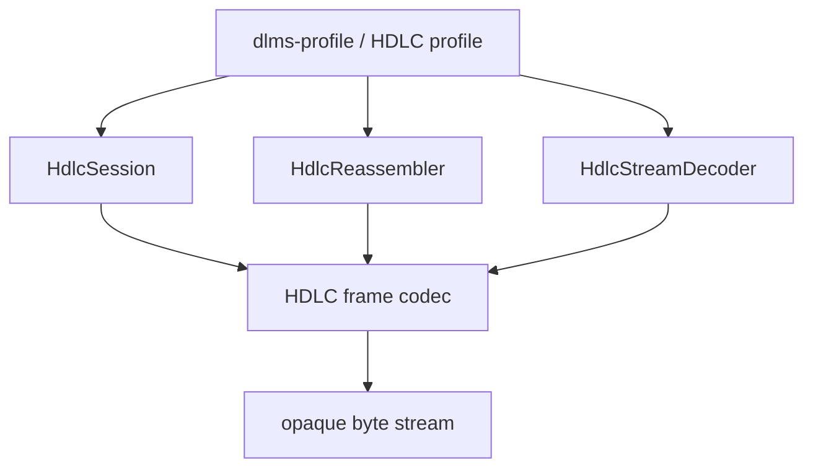
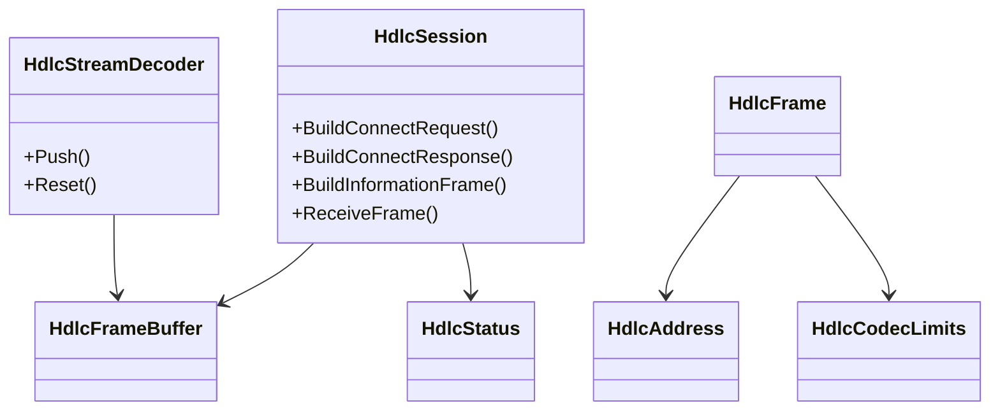
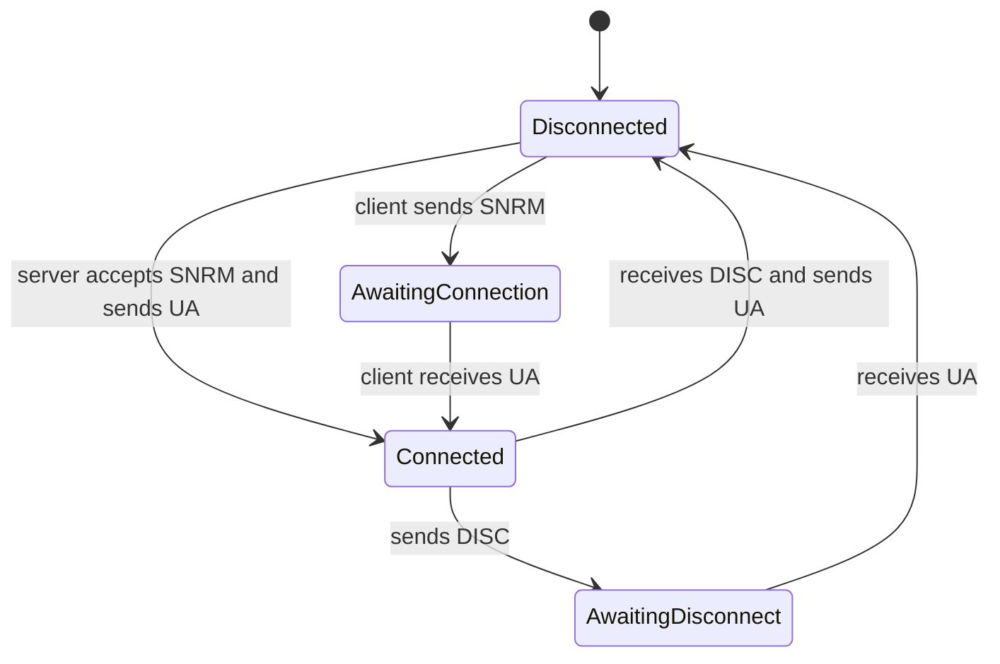

# HDLC Architecture

## 1. Scope

`dlms-hdlc` implements the DLMS/COSEM HDLC Type 3 frame codec, stream
decoder, segmentation/reassembly helpers, and a transport-independent HDLC
session state machine.

The library treats the HDLC `Information` field as opaque bytes. In the full
DLMS/COSEM HDLC profile, those bytes normally contain an LLC LPDU, but LLC and
APDU parsing are outside this repository.

## 2. In Scope

- HDLC address encoding and decoding.
- HDLC control field helpers.
- HDLC Type 3 frame encode/decode.
- HCS/FCS validation.
- Stream decoding by HDLC frame length.
- Segmentation and reassembly.
- HDLC session state transitions for SNRM/UA, DISC/UA, I-frames, and RR.
- C ABI wrapper.

## 3. Out of Scope

- Transport I/O.
- LLC LPDU parsing.
- APDU parsing.
- Application Association state.
- xDLMS invoke-id handling.
- Security and ciphering.

## 4. Dependencies

```text
dlms-hdlc
  -> C++ standard library
```

`dlms-hdlc` must not depend on `dlms-llc`, `dlms-wrapper`, `dlms-apdu`,
`dlms-profile`, or `dlms-transport`.

## 5. Layer Diagram



## 6. Class Interaction Diagram



## 7. State Machine



## 8. Error Model

Public runtime APIs return `HdlcStatus`. They must not throw exceptions, abort,
or rely on assertions for input validation.

## 9. Test Strategy

Unit tests cover address/control helpers, CRC, frame encode/decode, stream
decode, segmentation, session state transitions, real trace vectors, C ABI, and
C header compilation. Root integration tests validate HDLC only at cross-layer
boundaries with LLC/APDU payloads.
